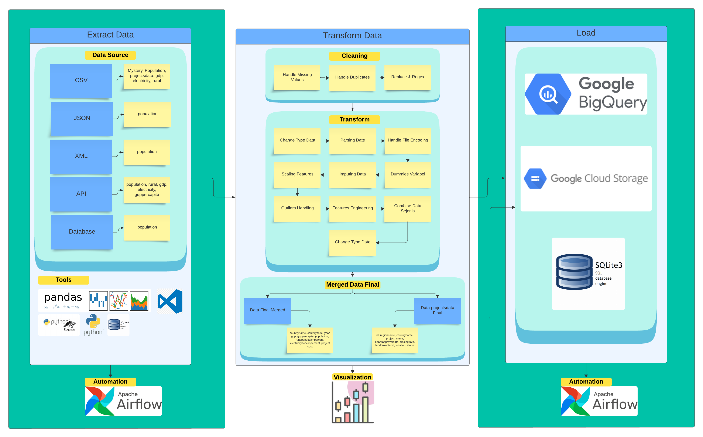

# ETL (Extract, Transform, Load) Pipeline with Analyze and Visualization

## About Project
- Proyek ini bertujuan untuk melakukan proses ETL (Extract, Transform, Load) pada berbagai sumber data untuk menghasilkan satu tabel yang bersih dan konsisten, sebagai bagian dari upaya membangun model prediksi biaya total proyek Bank Dunia, Populasi, Populasi Pedesaan, GDP, GDP Per Capita, Akses Listrik. Langkah pertama melibatkan ekstraksi data dari file CSV, JSON, XML, database, dan API World Bank. Kemudian, proses transformasi data dilakukan, termasuk penggabungan, pembersihan, penyesuaian tipe data, imputasi data yang hilang, penghapusan duplikasi, pembuatan variabel dummy, penggantian nilai, penghapusan outliers, penskalaan fitur, dan rekayasa fitur.
- Setelah proses transformasi selesai, data dimuat ke dalam database atau penyimpanan cloud. Selain itu, proyek juga melibatkan visualisasi data dan analisis statistik untuk memahami karakteristik dan tren dalam dataset yang digunakan. Alat dan teknologi yang digunakan dalam proyek ini meliputi Python dan berbagai library seperti Pandas, Numpy, Matplotlib, Seaborn, Plotly, serta layanan seperti Google Cloud Storage, SQLite, dan API World Bank.

## Tech Stacks
Daftar tools dan framework yang digunakan dalam project ini:
- Python
- Library dalam Python: Pandas, sqlite3, string, OpenAI, requests, json, re, seaborn, matplotlib.pyplot, plotly.express, plotly.graph-objects, BeautifulSoup, sklearn, Google Cloud, SQLite3, Airflow, env
- Jupyter Notebook
- Google Cloud Storage
- Google BigQuery
- GitHub
- MySQL
- API World Bank
- XML
- JSON 
- CSV
- DB
- Apache Airflow
- lain-lain

Tambahan:
- Windows Subsystem for Linux
- Ubuntu

## Architecture Diagram

## Setup 
Berdasarkan arsitektur diagram yang pada Project ini, berikut adalah langkah-langkah yang lebih jelas untuk setiap tahap proses data:

### Langkah 1: Persiapan Environment
1. **Instalasi Library dan Tools**:
   - Install Python dan library yang dibutuhkan seperti Pandas, sqlite3, string, OpenAI, requests, json, re, seaborn, matplotlib.pyplot, plotly.express, plotly.graph-objects, BeautifulSoup, sklearn, Google Cloud, SQLite3, Airflow, env.
   - Install Jupyter Notebook untuk analisis interaktif.
   - Pastikan memiliki akses ke Google Cloud Storage dan Google BigQuery.
   - Setup Windows Subsystem for Linux (WSL) dengan Ubuntu jika menggunakan Windows, untuk mendukung lingkungan development yang lebih baik.

2. **Konfigurasi Google Cloud**:
   - Setup Google Cloud SDK di sistem lokal.
   - Konfigurasi Google Cloud Storage dan Google BigQuery.
   - Buat bucket di Google Cloud Storage untuk menyimpan data.

### Langkah 2: Ekstraksi Data
1. **Sumber Data**:
   - Kumpulkan data dari berbagai sumber seperti CSV, JSON, XML, API, dan database.
   - Contoh data yang dikumpulkan: population, gdp, electricity, rural data.

2. **Tools untuk Ekstraksi**:
   - Gunakan library Pandas untuk membaca file CSV dan JSON.
   - Gunakan BeautifulSoup untuk parsing data XML.
   - Gunakan requests untuk mendapatkan data dari API.
   - Gunakan sqlite3 atau SQLAlchemy untuk mengakses database.

### Langkah 3: Transformasi Data
1. **Cleaning Data**:
   - Tangani nilai yang hilang (missing values).
   - Hapus duplikat.
   - Lakukan replace dan regex jika diperlukan.

2. **Transformasi Data**:
   - Ubah tipe data sesuai kebutuhan.
   - Parsing tanggal.
   - Tangani file encoding.
   - Scaling fitur.
   - Imputasi data yang hilang.
   - Buat variabel dummy jika diperlukan.
   - Tangani outliers.
   - Lakukan feature engineering.
   - Gabungkan data sejenis.

3. **Data Final Merged**:
   - Gabungkan semua data yang sudah dibersihkan dan ditransformasi untuk menghasilkan dataset final.

### Langkah 4: Load Data
1. **Google BigQuery**:
   - Muat data yang sudah diproses ke dalam Google BigQuery.
   - Gunakan BigQuery untuk analisis lebih lanjut.

2. **Google Cloud Storage**:
   - Simpan data yang sudah diproses ke dalam Google Cloud Storage untuk backup dan kebutuhan lainnya.

3. **SQLite3**:
   - Simpan data yang sudah diproses ke dalam database SQLite3 jika diperlukan untuk penggunaan lokal atau aplikasi kecil.

### Langkah 5: Analisis dan Visualisasi Data
1. **Analisis Data**:
   - Gunakan SQL di BigQuery untuk analisis data.
   - Gunakan Pandas untuk analisis data di Jupyter Notebook.

2. **Visualisasi Data**:
   - Gunakan seaborn dan matplotlib untuk visualisasi data di Jupyter Notebook.
   - Gunakan plotly.express dan plotly.graph-objects untuk visualisasi interaktif.

### Langkah 6 : Automation Process with Apache Airflow
1. **Automasi Proses**:
   - Buat dan jalankan DAG (Directed Acyclic Graph) di Apache Airflow untuk mengotomasi proses ekstraksi, transformasi, dan loading (ETL).
   - Setup scheduler di Airflow untuk menjalankan proses ETL secara periodik.

### Kesimpulan
Dengan mengikuti langkah-langkah di atas, diharapkan dapat membuat pipeline data yang komprehensif mulai dari ekstraksi data dari berbagai sumber, transformasi dan pembersihan data, hingga loading data ke data warehouse untuk analisis dan visualisasi lebih lanjut. Automasi menggunakan Apache Airflow memastikan proses ini berjalan dengan efisien dan dapat diulang secara periodik.